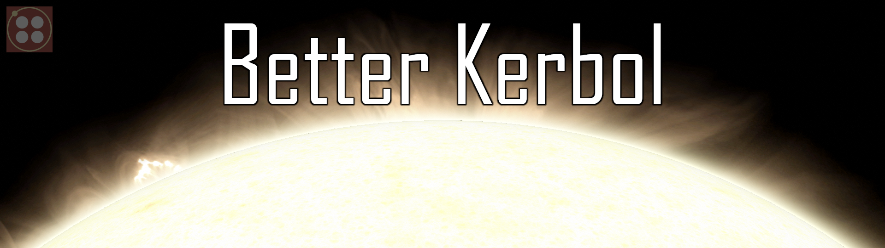

# BetterKerbol
Too long has stock Kerbol gone unloved. No longer will it sit at the center of the solar system, ugly and drab. With new high resolution textures, Scatterer support, and custom light curves, BetterKerbol attempts to remake Kerbol as eye candy worthy of pretty screenshots.
Towards this end, the radius has also been tweaked by an imperceptibly tiny amount, to get around a quirk in KSPs engine. This change does not effect the orbits of the planets, as Kerbol's mass is unchanged

With additional configuration, experience the searing light of Kerbol as you approach the corona, watch is it dims to a pale flicker as you travel beyond the orbit of Eeloo, and resize it to align better with the scale of the stock system.

## Features
### Base
* 8k Photosphere and Corona textures
* A visual surface that aligns with the true surface, opening up the possibility for spectacular close passes
* Scatterer configs for close up corona glow and sky tint when in the Kerbolar atmosphere
### Configurable
* Reduce Kerbol's radius by a factor of 4.24x to match scale with the stock system.
* Increasing brightness curve when closer to Kerbol than Kerbin SMA.
* Decreasing brightness curve when farther from Kerbol than Kerbin SMA.

## Notes
* Due to a long-standing bug in the way KSP calculates solar heat, temperatures near the surface are extreme, with radiant power density approaching infinity! Bring your exploit shielding or it's a one way trip!
* No sunflare is provided.  If using Scatterer, pick your favorite sunflare mod.

## Installation
* Extract the zip file
* Place the GameData folder into your KSP directory

## Configuration
* BetterKerbol has a few configurable settings, located at GameData/BetterKerbol/settings.cfg
  * useBetterSize
    * Default value: false
    * Expected values: true, false
    * Effect: Reduce Kerbol's radius by a factor of 4.24x to match scale with the stock system.
  * useProximityBrightening
    * Default value: true
    * Expected values: true, false
    * Effect: Increasing brightness curve when closer to Kerbol than Kerbin SMA.
  * useDistanceDimming
    * Default value: false
    * Expected values: true, false
    * Effect: Decreasing brightness curve when farther from Kerbol than Kerbin SMA.

## Requirements
* [ModuleManager](https://forum.kerbalspaceprogram.com/topic/50533-18x-112x-module-manager-423-july-03th-2023-fireworks-season/)
* [Kopernicus](https://forum.kerbalspaceprogram.com/topic/200143-112x-kopernicus-stable-branch-last-updated-june-17th-2024/)

## Provided Compatibility
* [Scatterer](https://forum.kerbalspaceprogram.com/topic/103963-wip19x-112x-scatterer-atmospheric-scattering-00838-14082022-scattering-improvements-in-game-atmo-generation-and-multi-sun-support/)

## Known Issues
* Certain TUFX settings (especially TAA and HDR) can occasionally cause a ring of flickering black pixels between the limb of Kerbol and the start of the corona.

## Licensing
* BetterKerbol is licensed by Attribution-NonCommercial-NoDerivs 3.0 Unported (CC BY-NC-ND 3.0)